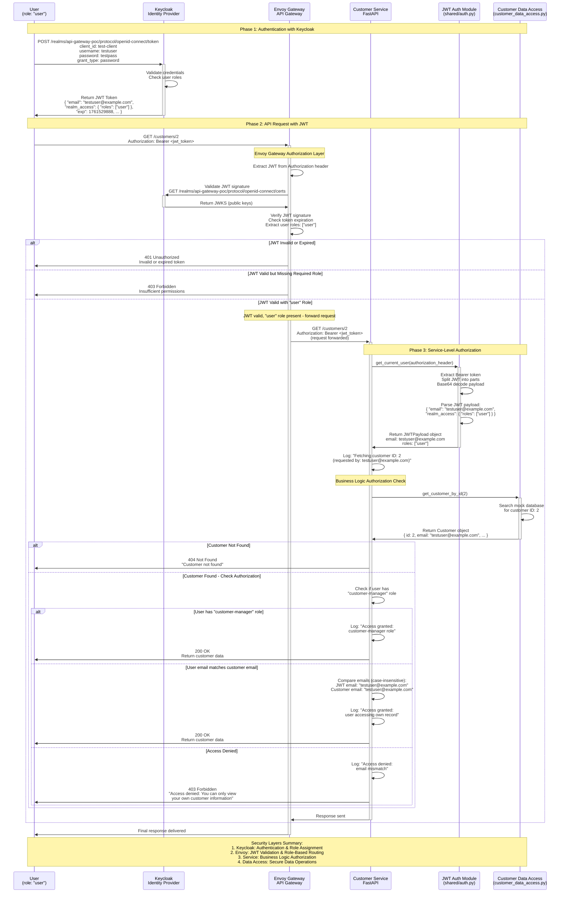

# Authentication & Authorization Flow

This document illustrates the comprehensive authentication and authorization flow in the API Gateway POC, showing how security is implemented across multiple layers.

## Overview

The system implements a layered security approach:

1. **Authentication Layer**: Keycloak handles user authentication and JWT token issuance
2. **Gateway Authorization**: Envoy validates JWT tokens and enforces role-based routing
3. **Service Authorization**: Individual services implement business logic authorization
4. **Data Access Layer**: Secure data operations with clean separation of concerns

## Sequence Diagram



## Security Layers Explained

### 1. Keycloak Authentication Layer
- **Purpose**: User authentication and JWT token generation
- **Responsibilities**:
  - Validate user credentials
  - Issue JWT tokens with user roles
  - Provide JWKS endpoint for token validation
- **Roles**: `user`, `admin`, `customer-manager`, `product-manager`

### 2. Envoy Gateway Authorization Layer
- **Purpose**: First line of defense for API access
- **Responsibilities**:
  - Validate JWT token signatures
  - Check token expiration
  - Enforce role-based routing rules
  - Forward valid requests to services
- **Configuration**: Routes require minimum "user" role for service access

### 3. Service-Level Authorization Layer
- **Purpose**: Business logic authorization
- **Responsibilities**:
  - Decode JWT payload for user information
  - Implement role-based access control (RBAC)
  - Enforce business rules (e.g., users can only access their own data)
  - Comprehensive audit logging

### 4. Data Access Layer
- **Purpose**: Secure data operations
- **Responsibilities**:
  - Abstract data access from business logic
  - Provide clean interface for data operations
  - Future database integration point

## Authorization Rules

### Customer Service
- **GET /customers**: 
  - `customer-manager` role: Access all customers
  - `user` role: Access only own customer record
- **GET /customers/{id}**: 
  - `customer-manager` role: Access any customer
  - `user` role: Access only if email matches

### Product Service
- **All GET endpoints**: Any user with `user` role (handled by Envoy)
- **Future write operations**: Will require `product-manager` role

## JWT Token Structure
```json
{
  "exp": 1761529888,
  "iat": 1761529588,
  "jti": "onrtro:f5c157db-fae7-c91c-9be1-6743885440ca",
  "iss": "http://localhost:8180/realms/api-gateway-poc",
  "sub": "ff7c5cc6-7c87-4f47-94af-f51a641dbbec",
  "typ": "Bearer",
  "azp": "test-client",
  "sid": "d1646165-67e7-5dbf-72c7-2c1b563aaba9",
  "acr": "1",
  "allowed-origins": [
    "http://127.0.0.1:*",
    "http://localhost:*"
  ],
  "realm_access": {
    "roles": [
      "user"
    ]
  },
  "scope": "profile email",
  "email_verified": true,
  "name": "Test User",
  "preferred_username": "testuser",
  "given_name": "Test",
  "family_name": "User",
  "email": "testuser@example.com"
}
```

## Error Responses

- **401 Unauthorized**: Invalid or missing JWT token
- **403 Forbidden**: Valid token but insufficient permissions
- **404 Not Found**: Resource doesn't exist
- **403 Business Logic**: Valid access but business rules deny operation

## Benefits of This Architecture

1. **Defense in Depth**: Multiple security layers
2. **Separation of Concerns**: Each layer has specific responsibilities
3. **Scalability**: Easy to add new services with consistent security
4. **Auditability**: Comprehensive logging at each layer
5. **Flexibility**: Different authorization rules per service
6. **Future-Proof**: Ready for database integration and additional roles

## Related Documentation

- [Security Guide](../security/security-guide.md)
- [Keycloak Setup](../setup/keycloak-setup.md)
- [Quick Reference](../development/quick-reference.md)